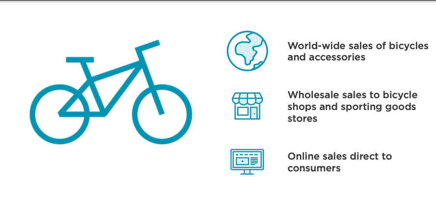

<!-- ABOUT THE PROJECT -->
# ETL with DBT:  `Data Transform`

`Data Warehouse:`AWS bicycle company has many locations in various parts of the world. However, their Transactional System (CRM Database) data are stored locally but more importantly the systems are not cross integrated. Another issue is that the CRM is not coordinated with online purchase thus led to following questions below



<details open>
<summary>
    
##### Questions: Business Intelligence
    
</summary>
        
- How can we see FASTER what is happening now? 
- How is business changing over time? 
- How can we analyze the data more effectively? 
- How can we discover what is driving the positive trends? 
- How can we stop or reverse negative trends? 
 
</details>   

<details open>
<summary>
    
##### Reasons: Business Intelligence 
</summary>
    
- No consistency in pulling data from transaction system 
- Difficulty making comparisons and spotting trends over time  
- Unable to respond quickly to sales trends or to changing customer behaviors 
- No Single Source of Truth (SSOT)

</details>  

<details open>
<summary>

 #####n The dbt Viewpoint: Our Approach 
 <bold>less robust faster result and limitedless functionality Easier than SSIS...Modern Approach</bold>
</summary>    
<table>
<tr> 
    <th><h5>Analytics is collaborative</h5></th>
</tr>
<tr>
<td>  
<pre lang="js">
    * `Version Control:` Code evolves and you should always know what changed, when.
    * `Quality Assurance:` Any code that generates code for analysis should be reviewed and tested.
    * `Documentation:` Package your code with descriptions for how it should be interpreted.
    * `Modularity:` Create data sets that are consistent and can be easily updated as logic changes.
</pre>
</td>
</tr>
</table>
***
<table>
<tr> 
    <th><h5>Analytics code is an asset</h5></th>
</tr>
<tr>
<td>  
<pre lang="js">
    * `Environments:` Analytics requires multiple environments.
    * `Service Level Guarantees:` Errors should be treated with the same urgency as bugs in production software.
    * `Design for Maintainability:`Most of the cost in development is in the maintenance phase.
</pre>
</td>
</tr>
</table>


- Benefits include consistent reporting available on-demand quickly 
- Infrastructure will expand in the future to support more subject areas 
- Manage and Document business processes 
</details>   

***

## Step-by-Step Explanation To Run This Project
***

<details open>
<summary>Environment </summary>
    
#### Azure: Create Storage 
    
* [`AzureStorage.md`](Starter-Code/AzureStorage.md) -- Step 1  CLI Code.

#### Snowflake: Create Data Warehouse 

* [`Snowflake.md`](Starter-Code/Snowflake.md) -- Step 1 CLI Code.

    
#### Integrate: Create stage integration for azure and snowflake 
    
* [`Snowflake.md`](Starter-Code/Snowflake.sql) -- Step 3 SQL Code.

    
#### Data Load: Load CSV and JSON files    
* [`Snowflake.md`](Starter-Code/Snowflake.sql) -- Step 4  SQL Code.

</details>

<details open>
<summary>GitHub Codespaces </summary>

```shell
Check python version: Python >= 3.5
git clone https://github.com/Jayboy628/cloud-snowflake-dbt.git
cd cloud-snowflake-dbt
python3 -m venv venv
source venv/bin/activate
python3 -m pip install --upgrade pip
pip install dbt-snowflake
python3 -m pip install -r requirements.txt
source venv/bin/activate
dbt build
dbt docs generate
dbt docs serve_
```

</details>

<!-- GETTING STARTED -->
## We're all set up... What's the plan? 
***

* `Transform` raw source data into structure data models on Snowflake using dbt.
* Save a `version-controlled` project on `GitHub`
* Modelling SCD1 and SCD2 Dimensions with dbt
* Model Star Schema `(Facts, Dimension)`
* `Automate testing and deploying` using GitHub Actions
* Create a schedule for running dbt models using a `Cron job`

